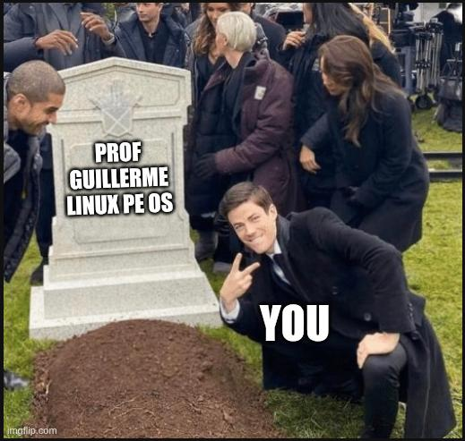

+++
title = 'Linux Pe Os'
date = '2025-10-25T12:01:29+01:00'
draft = false
enableImageZoom = false
showEdit= true
+++

Welcome this is my writeup on the _linux pe os_ labs given by [Prof Guillerme](https://www.linkedin.com/in/guillermeduvillie/) I hope you will learn something new and have a great time reading it.

A container version of this lab can be found on [docker hub](https://hub.docker.com/r/aspi858/ccmc-linux-pe) and the files on [github](https://github.com/aspi1234/ccmc-linux-pe)

I have organised the _impersonation_ of each **user** in the following steps :

1. Reconnaissance
2. Planning
3. Exploitation

**Let's do this !!**


## I. Special SUID Permissions : _jason_

### CONTEXT

> **What is a SUID Permission :** Assume we have two users on a system _user A_ and _user B_. _user B_ has a command that _user A_ needs to **run** to perform a certain task. instead of _user A_ having to **request** either the _password_ or presence of _user B_ to run this command each time, _user B_ can simply set the `SUID` bit on this command and anyone can run this command with the same **privilegies** of _user B_ ( as _user B_).You can find detailled information about linux `SUID` on google or you can read my post on the topic {}.

### 1. Reconnaissance : Finding SUID Files

Our first step is to find any programs on the system that have this special SUID permission. It would be difficult to check every file manually, so let's use a search tool called `find`.

We will ask `find` to search the entire filesystem (`/`) for files (`-type f`) that have the SUID permission bit set (`-perm -4000`).

`$ find / -perm -4000 2>/dev/null`

The search gives us a few results, but **two** files look particularly _interesting_ and _non-standard_:



To get more details about these files, like who owns them, we can enhance our `find` command by telling it to execute `ls -l` on every file it finds:

`$ find / -perm -4000 2>/dev/null -exec ls -l {} +`



The output confirms what we need to know:

- `/usr/bin/print_my_stuff` is owned by the user **laela**.
- `/usr/share/print_file` is owned by the user **jason**.

### 2. Planning

Irrespectively of what each program does, We now know that, if we run `/usr/share/print_file`, the system will execute it with all of _jason_'s privileges. Likewise, running `/usr/bin/print_my_stuff` will grant it _laela_'s privileges.

Our plan is simple:

1.  **Investigate what each of these programs does**.
2.  **Determine if we can use their functionality**, combined with their elevated permissions, to read sensitive files belonging to their owners.

### 3. exploitation

#### a. `/usr/bin/print_my_stuff`

Running this program simply prints the contents of _laela's_ home directory. While it confirms the SUID permission is working, it doesn't seem to offer any way to control it, so we can't do much with it for now.

#### b. `/usr/share/print_file`

This program is more promising. Its name, `print_file`, strongly suggests its purpose. Let's test its behavior. If we run it with the name of a file as an argument, it might print that file's contents to the screen.

Since the program runs as _jason_, it should be able to read any file that _jason_ can. Let's try to use it to read `secret.txt` from _jason_'s home directory.



**Success !** Because the `print_file` program is owned by _jason_ and has the `SUID` permission set, the operating system granted our request to read the file using _jason_'s permissions. We were able to see the contents of his secret file, even though our own user would normally not have access.

---

## II. Path Abuse : _laela_

### CONTEXT

Whenever you type a command like `ls` or `cd` into your terminal, how does the shell know where to find the program to execute? It doesn't magically know that the `ls` program is located in the `/usr/bin/` directory.

Instead, it consults an environment variable called {}.

The `PATH` is simply a list of directories, separated by colons (`:`), that the shell will search through whenever it's asked to run a command. You can see this list yourself by running:<br>
`$ echo $PATH`
The shell searches these directories in order, from left to right. The very first executable it finds with a matching name is the one it runs.

### 1.Enumeration/Reconnaisance

From our previous investigation, we know about the SUID program `/usr/bin/print_my_stuff`, which is owned by _laela_. Let's see if we can find any other files related to this program that might give us clues about how it works. We can use `find` again to search for all files on the system owned by _laela_.

`$ find / -user laela 2>/dev/null`



We've found the source code for the program, located at `/var/backup_files/print_my_stuff.c`. This is a huge advantage, as we can now examine exactly what the program does. Let's look at its contents.



Looking at the code, two lines stand out:

1.  `setuid(geteuid());`: This line confirms that the program is intended to run with the full permissions of its owner, _laela_.
2.  `system("tree /home/laela");`: This is the crucial line. The program executes the `tree` command to list the contents of _laela_'s home directory.

### 2. Planning

Our path to exploitation is now clear. When we run `/usr/bin/print_my_stuff`, the following will happen:

- The program will start running with _laela_'s permissions because of its SUID bit.
- It will then try to execute the `tree` command.
- The shell will search for `tree` in the directories listed in our `PATH` variable.

Our plan is to control which `tree` program gets executed. We will:

1.  Create our own script and name it `tree`. This script won't list files; instead, it will be designed to read _laela_'s secret file.
2.  Place this script in a location where we have write permissions, such as the `/tmp` directory.
3.  Modify our `PATH` variable to put `/tmp` at the very beginning of the list. This will cause the shell to find our **fake** `tree` before it finds the **real** one.

### 3. Eploitation

Let's put the plan into action.

**First, create our malicious `tree` script.** We want it to read _laela_'s secret file. The `cat` command is perfect for this. We will create a file at `/tmp/tree` with the following content:

```bash
#!/bin/bash
# /tmp/tree content
cat /home/laela/secret.txt
```

**Second, make the script executable.** The system won't run the script if it doesn't have the execute permission set. We'll use `chmod` to give it the necessary permissions.

`$ chmod 777 /tmp/tree`

**Third, prepend `/tmp` to our `PATH`.** This is the most important step. By placing `/tmp` at the front, we ensure our malicious script is found first.

`$ PATH=/tmp:$PATH`



**Finally, run the SUID program.** When we execute `print_my_stuff`, it will inherit our modified `PATH`, find our script in `/tmp`, and run it with _laela_'s privileges.

`$ /usr/bin/print_my_stuff`


And just like that, instead of listing the files in _laela_'s directory, the program executes our script and prints the content of her secret file.

---

## III. Using `sudo` with `xxd` direct read for user _landis_

### CONTEXT

So far, we've seen how SUID permissions on specific programs can grant us the powers of another user for a single task. `sudo` (short for "superuser do") operates on a similar principle but is far more powerful and configurable. More on `sudo` vs `suid` {}.

The `root` user is the administrator of a Linux system and can do anything. The `sudo` command allows a system administrator to grant certain users the ability to run specific commands _as if_ they were the `root` user.

This is managed through a configuration file located at `/etc/sudoers`. This file contains the rules that define which users can run which commands with `sudo`. When you run a command with `sudo`, the system checks this file to see if you are authorized. If you are, it executes your command with `root`'s privileges.

### 1. Reconnaissance/Enumeration

How can we know what commands, if any, our current user is allowed to run with `sudo`? Thankfully, there's a simple command for that. The `-l` (list) flag will tell us exactly what our privileges are.<br>

`$ sudo -l`

Let's run this and see what it says about our _user_.



The output tells us **two** crucial things:

- `(root)`: We are allowed to run the command as the `root` user.
- `/usr/bin/xxd`: The specific command we are allowed to run as `root` is `xxd`.

`xxd` is a command-line tool that creates a "hex dump" of a file. This means it takes any file as input and outputs its contents as a sequence of hexadecimal numbers.

### 2. Planning

Our reconnaissance has given us a clear path forward. We have the ability to run the `xxd` command with the full, unrestricted power of the `root` user. Since `root` can read any file on the entire system, we can use `xxd` to look at files that are normally completely off-limits to us, including the secret files of other users.

Our plan is to use our `sudo` rights to run `xxd` on _landis_'s secret file.

### 3. Exploitation

Going through the [gtfobins](https://gtfobins.github.io/) we see that we can _read/write_ to any file with `xxd` if it can be called/used with the `sudo` command with the following command.

`$ sudo xxd "file name" | xxd -r`

Let's try this on _alan's_ secret file :



---

## IV. Using `sudo`,`xxd` and `john` to crack `alan` password

### CONTEXT

We've established that our `sudo` privilege with `xxd` allows us to read _any file_ on the system.Let's use this ability to read the `/etc/shadow` file as stated by the lab.

On modern Linux systems, passwords are not stored in plain text. For security reasons, the system takes a user's password and runs it through a one-way cryptographic function to create a unique "fingerprint" called a **hash**. This process is irreversible; you can't turn the hash back into the original password. These hashes are stored in a highly-protected file: `/etc/shadow`.While we can't reverse the hashes, we can try to guess the password.

### Planning

Our previous exploitation gives us a clear advantage. We can read the [/etc/shadow](https://www.cyberciti.biz/faq/understanding-etcshadow-file/) file, which means we can get the password hash for any user on the system, including `alan`.

Our plan will have four steps:

1.  Use our `sudo xxd | xxd -r` technique to read the contents of `/etc/shadow`.
2.  Save `alan`'s password hash into a new file that we can work with.
3.  Use a password cracking tool, [John the Ripper](https://www.openwall.com/john/), along with a common wordlist [rockyou.txt](https://weakpass.com/wordlists/rockyou.txt), to find the original password.


If you have `kali Os` available, both the `rockyou.txt` wordlist[2] and `john the ripper` are available by default on `kali` so no **need** to download


### 2. Exploitation

**Step 1: Read the `/etc/shadow` file**

We'll use the same command as before, but this time we will redirect the output (`>`) into a file named `shadow.txt` in our current directory. This makes it much easier to work with.

`$ sudo xxd "/etc/shadow" | xxd -r > shadow.txt`

Now, if we look at the contents of `shadow.txt` (`cat shadow.txt`), we will see the password hashes for all users on the system.

**Step 2: Isolate `alan`'s Hash**

To make the cracking process faster and cleaner, we can copy the line corresponding to `alan`'s account into a new file. Let's call it `alan_hash.txt`. The file should contain only one line, which will look something like this:

`alan:$6$somerandomsalt$anotherlongstringofcharacters:18214:0:99999:7:::`

**Step 3: Crack the Hash with John the Ripper**

Now we can unleash John the Ripper on this hash. We will point it to our wordlist and the file containing the hash.

`$ john --wordlist=/path/to/rockyou.txt --format=crypt alan_hash.txt`

- `--wordlist=...`: This tells John which list of passwords to try.
- `alan_hash.txt`: This is the file containing the hash we want to crack.

John will start guessing passwords. If it finds a match, it will print the cracked password to the screen. After a short time, it should reveal `alan`'s password to be `grant`.

**Step 4: Log In and Read the Secret**

With the password in hand, the final step is simple. We can use the `su` command to log in as `alan`.

`$ su - alan`
(Enter the password `grant` when prompted)

Once we are logged in as `alan`, we have all of his permissions. We can now easily read his secret file.

`$ cat /home/alan/secret.txt`

We have successfully used a file-read vulnerability to achieve a full account compromise.

---

## V. Abusing `systemd` to **read** _jean_ secret's message

### CONTEXT

On most linux system after the `kernel` is done preparing the hardware devices and making them visible to the `OS` it give space to the a _process orchestrator_ called [`systemd`](https://documentation.suse.com/smart/systems-management/html/systemd-basics/index.html). `Systemd` is the program in charge of bringing the computer to usefull state based on the [target levels](https://www.baeldung.com/linux/boot-process) it needs to reach. It does so by reading [`unit`](https://www.digitalocean.com/community/tutorials/how-to-use-systemctl-to-manage-systemd-services-and-units#unit-management) file for `services` under the `/etc/systemd/system/` directory which contains sysadmin custom services.


### 1. Reconnaissance/Enumeration

Our goal is to find a poorly configured `systemd` service that we can take advantage of. We'll start by looking in the directory where custom services are stored. It's often helpful to list the files by modification time (`-lt`) to see if anything has been added recently.

`$ ls -lt /etc/systemd/system`



A file named `backup.service` immediately stands out. This doesn't look like a standard system service. Let's examine its contents to understand what it does.



So, we have a service that runs a script as _jean_. The final and most important question is: can we modify that script? Let's check its permissions.

`$ ls -l /usr/bin/backup.sh`



This is the vulnerability. The permissions `-rwxrwxrwx` mean that _any user_ on the system has full read, write, and execute permissions on this file. We can change its contents to whatever we want.

#### c. Content of `/etc/systemd/system/mutli-user.target.wants/backup.service`



#### d. premissions and content of `/usr/bin/backup.sh`



### 2. Planning

Here is what we know at this point :

1.  A service, `backup.service`, is configured to run automatically when the system starts.
2.  This service runs with the full permissions of the user _jean_.
3.  The service executes a script, `/usr/bin/backup.sh`, which we are allowed to modify.

We will replace the contents of the `backup.sh` script with our own command. Instead of performing a backup, the script will copy _jean_'s secret file into a public directory like `/tmp`, where we can easily read it.

### 3. Exploitation

**First, let's modify the script.** We will overwrite its contents with a simple copy command.



**Next, we need to trigger the service.** The easiest way to trigger it is to simply restart the lab machine. When it boots back up, `systemd` will execute our modified script as the user _jean_.After the machine restarts, we can read the flag our script will have copied to the `/tmp` directory. All we have to do is view its contents.

`$ cat /tmp/jean_secret.txt`


---

## VI Abusing `pam` module to impersonnate user `giselle`

### CONTEXT

On a Linux system, many different programs need to authenticate users—`login`, `su`, `ssh`, the graphical lock screen, and so on. Instead of each program implementing its own authentication logic, they use a centralized and flexible framework called (PAM (Pluggable Authentication Modules))[https://docs.rockylinux.org/10/guides/security/pam/].These are set of security checkpoints that an application can use. An application like `ssh` can be configured to say, "For authentication, I need to check rule #1, then rule #2, then rule #3." These rules are defined in configuration files located in the `/etc/pam.d/` directory.Each rule in a PAM configuration file calls a specific "module" (a small library, like `pam_unix.so`) that performs a single task, such as checking the user's password against `/etc/shadow`. By editing these configuration files, a system administrator can change the entire authentication process for a program without ever touching the program itself.

### 1. Reconnaissance/Enumeration

Let's start by exploring the `/etc/pam.d/` directory to see if there are any unusual or recently modified files.<br><br>
`$ ls -lt /etc/pam.d/`

A file named `custom-rule` stands out. This is not a standard system file. Let's check its contents and, more importantly, its permissions.<br><br>
`$ ls -l /etc/pam.d/custom-rule`<br>
`$ cat /etc/pam.d/custom-rule`

Now we need to find out which authentication process actually uses this file. We can search for any files in `/etc/pam.d/` that include our `custom-rule` file using the `grep` command as follows.<br>

`$ grep -r "custom-rule" /etc/pam.d/`

The search points us to `/etc/pam.d/common-auth`.`common-auth` is a central file that contains authentication rules shared by many different services (`login`, `su`, etc.). Let's look inside this file.
`$ cat /etc/pam.d/common-auth`
Content of `/etc/pam.d/common-auth`

Inside `common-auth`, we find two interesting lines, one after the other:

```bash
1. auth    [success=1 default=ignore]    pam_succeed_if.so user != giselle
2. @include custom-rule
```

Let's break down what that first line does:

- `auth`: This rule applies to the authentication process.
- `pam_succeed_if.so user != giselle`: This module checks a condition. It "succeeds" if the user trying to authenticate is **not** `giselle`. It "fails" if the user **is** `giselle`.
- `[success=1 default=ignore]`: This is the control logic.
  - `success=1`: If the module succeeds (the user is _not_ `giselle`), then **skip the next 1 rule**. This means the `@include custom-rule` line will be completely ignored.
  - `default=ignore`: If the module results in anything other than success (i.e., it fails because the user _is_ `giselle`), then just ignore this outcome and **continue to the next rule**.

In simple terms: The `custom-rule` file is **only** processed when the user trying to log in is `giselle`.

### 2. Planning

1.  We know that the contents of the `custom-rule` file are executed only when someone tries to authenticate as `giselle`.
2.  We have permission to write whatever we want into the `custom-rule` file.

The plan is simple. We will add a new rule to the `custom-rule` file that will automatically grant authentication, no questions asked. There is a special PAM module perfect for this job called `pam_permit.so`. Its only purpose is to always return "success."

### 3. Exploitation

**First, we will add our rule to the `custom-rule` file.**

`$ echo 'auth sufficient pam_permit.so' > /etc/pam.d/custom-rule`

Let's understand this rule:

- `auth`: It applies to authentication.
- `pam_permit.so`: This module always succeeds.
- `sufficient`: This control flag means that if this module succeeds (which it always does), PAM should consider the entire authentication process immediately successful and not bother checking any further rules (like the one that asks for a password).

**Now, let's try to become `giselle`.** We will use the `su` command.

`$ su - giselle`

Here is what happens :

1.  The `su` command starts the PAM authentication process for the user `giselle`.
2.  PAM reads the `common-auth` file.
3.  The first rule (`pam_succeed_if.so user != giselle`) fails, because the user _is_ `giselle`. The `default=ignore` logic tells PAM to simply move to the next rule.
4.  The next rule is `@include custom-rule`. PAM now reads our file.
5.  Our rule, `auth sufficient pam_permit.so`, is executed. The `pam_permit.so` module returns success.
6.  The `sufficient` flag tells PAM, "That's good enough for me!" The authentication is declared a success, and the subsequent rules (including the one that would ask for `giselle`'s password) are never processed.

Without asking for a password, the system grants us a shell as `giselle`. We have successfully bypassed the authentication process.

We have successfully impersonated all the user So what's next ??
Let's become root and tear everything apart !! **shall we**

First run let's run the following command

```bash
$ echo "user ALL=(root) ALL" | xxd | sudo xxd -r - "/etc/sudoers.d/user"
```

Log in as the `root` user and **LMAO**

```bash
$ sudo su root
$ rm -rf /
```


Do not **run** this on your host machine



**Gongrats !!**
